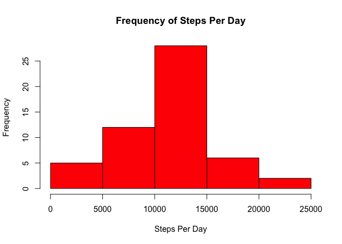
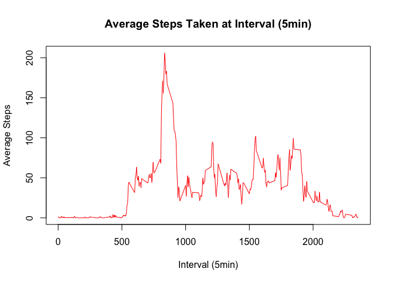
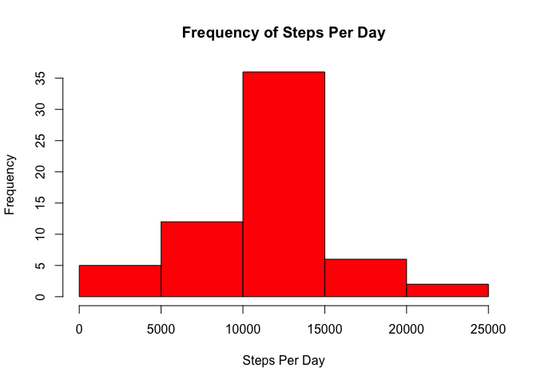
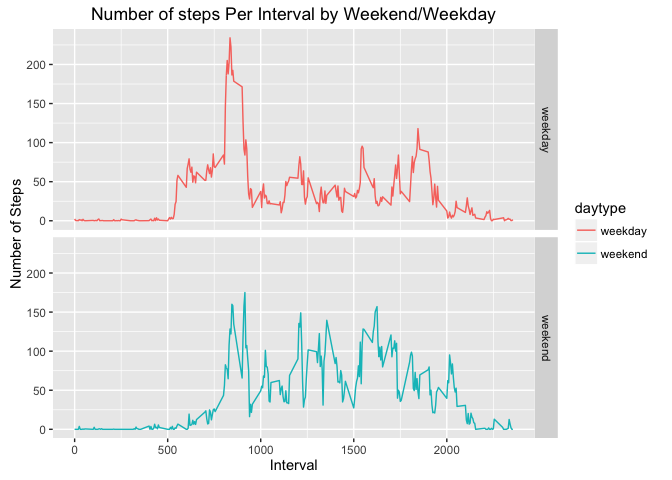

Introduction
------------

It is now possible to collect a large amount of data about personal
movement using activity monitoring devices such as a Fitbit, Nike
Fuelband, or Jawbone Up. These type of devices are part of the
“quantified self” movement – a group of enthusiasts who take
measurements about themselves regularly to improve their health, to find
patterns in their behavior, or because they are tech geeks. But these
data remain under-utilized both because the raw data are hard to obtain
and there is a lack of statistical methods and software for processing
and interpreting the data.

This report makes use of data from a personal activity monitoring
device. This device collects data at 5 minute intervals through out the
day. The data consists of two months of data from an anonymous
individual collected during the months of October and November, 2012 and
include the number of steps taken in 5 minute intervals each day.

First lets read in the data and store in variable called activity.

    activity <- read.csv("data/activity.csv", stringsAsFactors = FALSE)

To clean up the data we will convert steps to a numeric and Dates to the
date datatype.

    activity_na_rm <- activity[!is.na(activity$steps),]
    activity_na_rm$steps <- as.numeric(activity_na_rm$steps)
    activity_na_rm$date <- as.Date(activity_na_rm$date, "%Y-%m-%d")

Lets calculate the mean total number of steps taken per day. But first
lets visualize the data in a histogram of the total number of steps
taken each day.

    activity_sums <- aggregate(steps ~ date, activity_na_rm, sum)
    hist(activity_sums$steps, breaks = 5, main = "Frequency of Steps Per Day", xlab = "Steps Per Day", ylab = "Frequency", col = "red")

Now lets calculate the mean and median number of steps taken each day
Mean:

    round(mean(activity_sums$steps))

    ## [1] 10766

Median:

    round(median(activity_sums$steps))

    ## [1] 10765

Now that we know a little bit more about the average step count lets try
and figure out at what time the subjects walk the most.

To do this we will visualize the average daily activity pattern by
generating a time series plot of the average number of steps taken.

    meansteps_per_interval <- tapply(X = activity_na_rm$steps, INDEX = activity_na_rm$interval, FUN = mean)
    plot(x = unique(activity_na_rm$interval), y = meansteps_per_interval, type = "l", main = "Average Steps Taken at Interval (5min)", xlab = "Interval (5min)", ylab = "Average Steps", col = "red")

From the time series plot we can see that the average maximum number of
steps occur between interval 500 and 1000, but its hard to tell the
exact interval. Lets calculate the exact interval.

    meansteps_per_interval <- data.frame(interval = names(meansteps_per_interval), avg_steps = meansteps_per_interval, stringsAsFactors = FALSE)
    max_interval <- max(meansteps_per_interval$avg_steps)
    max_steps_interval <- meansteps_per_interval[meansteps_per_interval$avg_steps == max_interval,]$interval
    max_steps_interval

    ## [1] "835"

We now know that on average the most steps occur during the interval
835.

**Note**: There are a number of days/intervals where there are missing
values (coded as 𝙽𝙰). The presence of missing days may introduce bias
into some calculations or summaries of the data.

Lets calculate the total number of missing values.

    missing_values <- nrow(activity[is.na(activity$steps),])

We have 2304 NA's.

To generate a more acurate graph lets replace the NA step counts with
the average count for that interval. Then plot on a histogram.

    for(i in 1:nrow(activity)) {
      if(is.na(activity$steps[i])) {
        curr_steps <- meansteps_per_interval$avg_steps[which(meansteps_per_interval$interval == activity$interval[i])]
        activity$steps[i] <- curr_steps
      }
    }

    activity_sums_no_nas <- aggregate(steps ~ date, activity, sum)

    hist(activity_sums_no_nas$steps, breaks = 5, main = "Frequency of Steps Per Day", xlab = "Steps Per Day", ylab = "Frequency", col = "red")

Now lets calculate the mean and median number of steps taken each day
with the missing data filled in. Mean:

    round(mean(activity_sums_no_nas$steps))

    ## [1] 10766

Median:

    round(median(activity_sums_no_nas$steps))

    ## [1] 10766

We can see not much has change in the form of mean and median from when
we just removed the NA's.

Now we will look at the trends of steps between weekend and weekday. To
do this we will split the data between two factors "weekend" and
"weekday".

    library(ggplot2)

    ## Warning: package 'ggplot2' was built under R version 3.2.4

    weekday <- function(aDate) {
        wd <- weekdays(aDate)
        if  (wd == 'Saturday' || wd == 'Sunday') {
            x <- 'weekend'
        } else {
            x <- 'weekday'
        }
        x
    }

    activity_na_rm$daytype <- as.factor(sapply(activity_na_rm$date, weekday))

    activity_na_rm <- aggregate(steps ~ interval+daytype, activity_na_rm, mean)

    plt <- ggplot(activity_na_rm, aes(interval, steps)) + geom_line(stat = "identity", aes(colour = daytype)) +
        facet_grid(daytype ~ ., scales="fixed", space="fixed") + xlab("Interval") +
        ylab("Number of Steps") + ggtitle("Number of steps Per Interval by Weekend/Weekday")

    print(plt)

We can see that during the weekdays subjects tend to start off strong
but slow down later on in the week. During the weekend we see a better
distribution between the intervals.
